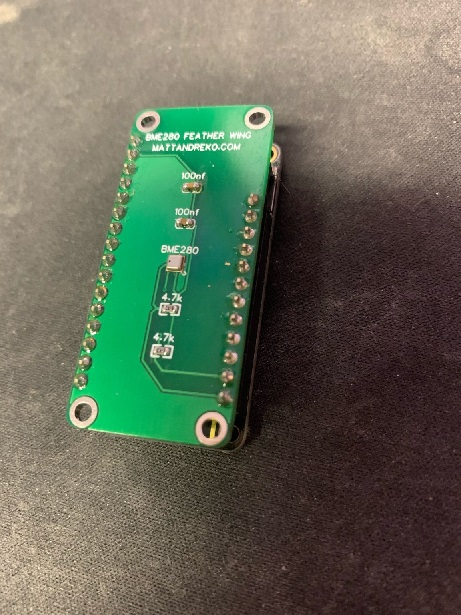
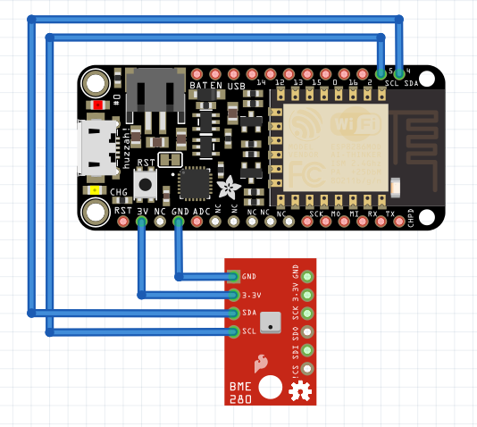
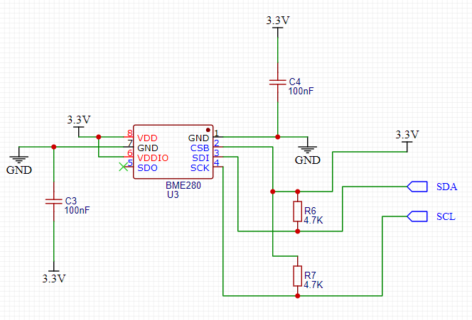
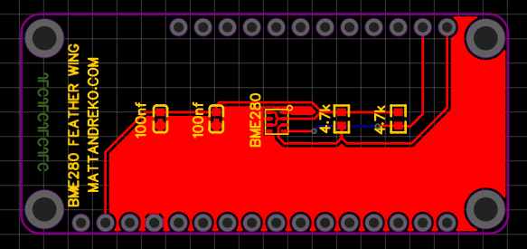
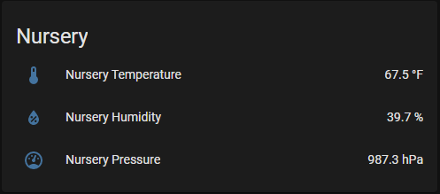

## Adafruit Feather Huzzah 8266 BME280 Wing

Simple Feather Wing to measure temperature, humidity, and pressure from a BME280 component.

## License

 This work is licensed under a <a rel="license" href="http://creativecommons.org/licenses/by-sa/4.0/">Creative Commons Attribution-ShareAlike 4.0 International License</a>.

## Parts needed

- 1 x Adafruit Feather Huzzah 8266
- 1 x BME280 component
- 2 x 4.7kΩ resistor
- 2 x 100nf capacitors
- 1 x stacking headers kit (both male and female)

You can pick all the items up via this Octopart BOM: [https://octopart.com/bom-tool/ZmIur875](https://octopart.com/bom-tool/ZmIur875). 

## Description

I often used "off the shelf" BME280 sensors with my ESP8266 boards to monitor temperature and humidity of various rooms in my house. However, having tiny breadboards and random wires hanging off was less than desirable. I figured this would be an easy board to prototype and make a stacking header. 

Adafruit Feathers support LiPo batteries, which give the chips the ability of staying on if power is lost from the wall. With the built-in charging circuit, you can run it from a 5v wall plug, and it'll charge the LiPo, acting similarly to a UPS. Additionally, the Feather provides WiFi capability to add it to my home network with HomeAssistant/ESPHome.

*Do note, that the BME280 component is an LGA package, which means to solder it, you will need a reflow oven or hot air station.*

While designing this circuit, I referred to the [Adafruit Feather Huzzah ESP8266 pinout](https://learn.adafruit.com/adafruit-feather-huzzah-esp8266/pinouts/) document often. 
 
## Schematic

I originally had this on a breadboard, with an "off the shelf" BME280 board connected to the ESP8266, which was less easy to play with. It essentially looked like this ([Fritzing file](Huzzah_BME280_Sensor.fzz)):

To make it easier, to assemble and to look more professional when I shared it with others, I decided to use a custom PCB that anyone could order. Being a fairly new PCB designer, I used EasyEDA to design my circuit.

## PCB

I've included the [Gerber files](adafruit_feather_huzzah_8266_bme280_gerber.zip) if you want to order your own PCB from [JLCPCB](https://jlcpcb.com/) or somewhere else.

## HomeAssistant Example

I've included an [example](esphome.yaml) of how I setup the Adafruit Feather Huzzah ESP8266

## 3D Printed Case

TODO: Make a custom case based on this amazing Adafruit case: https://www.thingiverse.com/thing:2209964
